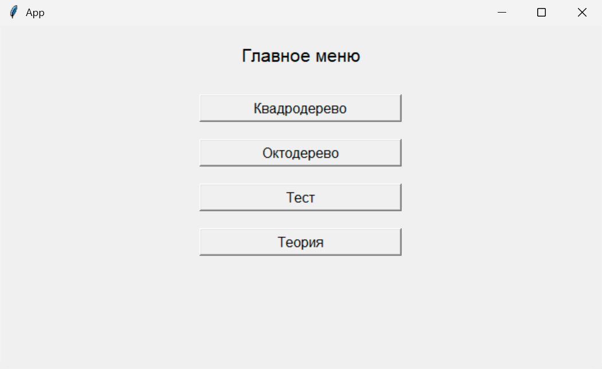
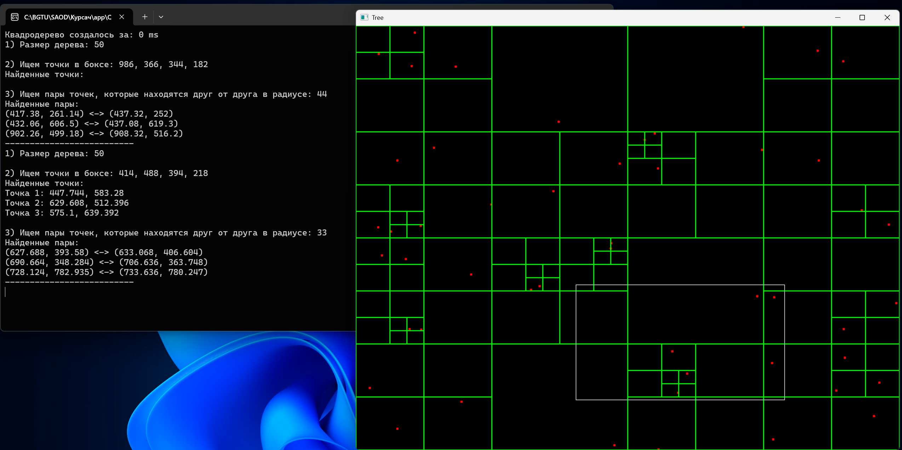
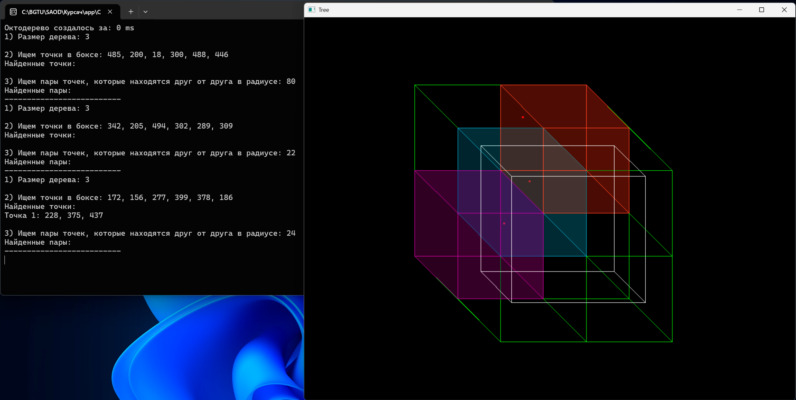

# 🌳 QuadOctreeVisualizer

Визуализация **квадро-** и **октодерева** с помощью **SDL2 (C++)** и интерфейса на **Python (Tkinter)**. Проект демонстрирует работу пространственных структур данных в 2D и 3D пространстве: от построения дерева до поиска точек и пар по радиусу.

---

## 🧩 Описание проекта

Проект разделён на две части:
1. cpp_visualizer/ – написано на **C++** + **SDL2**:
    - Реализует **QuadTree** и **Octree**.
    - Отрисовывает точки, границы дерева и визуализирует поиск в области.
    - В случае с Octree применяется простая **изометрическая проекция**.
    - Поиск выполняется каждые 5 секунд: рисуется прямоугольник (или куб), показываются найденные точки и пары.
2. python_gui/ – написано на **Python (Tkinter)**:
    - Интерфейс с кнопками для запуска нужного дерева или теста.
    - Запускает `.exe` визуализатора с нужным флагом (0 – квадро, 1 – окто).
    - Также содержит мини-тест и теорию для повторения материала.

---

## 📸 Скриншоты

### Главное меню Python-приложения


### Квадродерево: точки, границы, прямоугольник запроса


### Октодерево: кубы, точки, цвета


---

## 🚀 Основные возможности

- Построение **QuadTree** с динамически движущимися точками.
- Визуализация **Octree** с изометрической 3D проекцией и закрашенными октантами.
- Поиск точек в области и пар точек в пределах заданного радиуса.
- Запуск поиска каждые 5 секунд – наглядная динамика.
- Вывод статистики и результатов поиска в консоль.
- Python GUI с кнопками для запуска нужной части проекта, мини-тестом и теорией.

---

## 🛠️ Технологии

- **C++**, **SDL2**.
- **Python 3.13**, **Tkinter**, **subprocess**
- IDE: Visual Studio (C++), PyCharm (Python)
- Написано около **1600 строк C++** и **434 строки Python**

---

## 📁 Основные папки

- `cpp_visualizer/` — исходный код C++ для визуализации QuadTree/Octree
- `python_gui/` — Python GUI-приложение с интерфейсом, теорией и тестом
- `screenshots/` — скриншоты для README

---

## 🚀 Как запустить проект

1. Склонируйте репозиторий:
```bash
git clone https://github.com/CTTAPTAH/QuadOctreeVisualizer.git
```
2. Откройте C++-проект в Visual Studio:
    - Откройте `QuadOctreeVisualizer/cpp_visualizer/QuadTree.sln`.
    - Постройте и запустите (F5). Все библиотеки уже подключены, нужные `.dll` копируются автоматически.
3. Откройте Python GUI:
    - Перейдите в `python_gui/`.
    - Запустите `main.py`. Убедитесь, что установлен Python 3.13+.
    - Выберите дерево или тест. Нужный `.exe` запустится автоматически.

## 📄 Лицензия

Проект распространяется под лицензией [MIT](LICENSE). Вы можете использовать, изменять и распространять код в любых целях с сохранением условий лицензии.
